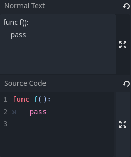

# godot-inspector-code-highlighter

Adds GDScript syntax highlighting to the Inspector.

Compatible with **Godot 4.3 dev 6**.

See [godotengine/godot-proposals#9749](https://github.com/godotengine/godot-proposals/issues/9749) for details.

```gdscript
@export_multiline var normal_text: String
@export_custom(PROPERTY_HINT_MULTILINE_TEXT, "lang=gdscript") var source_code: String
```


